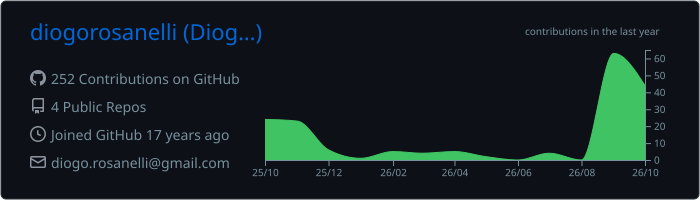
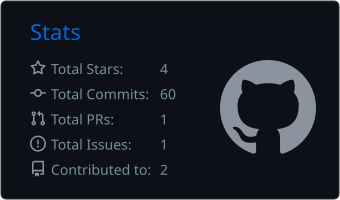

<!-- Header -->
<p align="center">
  
</p>

<p align="center">
  <a href="https://github.com/diogorosanelli">
    
  </a>
</p>

<p align="center">
  <a href="https://www.linkedin.com/in/diogorosanelli"></a>
  <a href="mailto:diogo.rosanelli@gmail.com"></a>
  <a href="https://x.com/diogorosanelli"></a>
  <a href="https://www.instagram.com/diogorosanelli"></a>
  <a href="https://www.facebook.com/diogorosanelli"></a>
  <a href="https://github.com/GISLABTech"></a>
</p>

---

## 🌎 Sobre mim

Trabalho com **inteligência geográfica desde 2000** — comecei georreferenciando imagens de satélite e gerenciando a base cartográfica de **mais de 1.500 cidades brasileiras**, e hoje desenho soluções que unem **GIS, IA e dados** para resolver problemas reais de negócio.

Atuo no ciclo completo: **discovery com o cliente → arquitetura → desenvolvimento → implantação**. Fui tech lead de projetos GIS corporativos para grandes empresas de energia, saneamento, telecom e celulose, e hoje lidero a **[GISLAB Tech](https://github.com/GISLABTech)** e atuo como **Especialista GIS & IA** na **[Imagem](https://www.img.com.br/pt-br/home)**, distribuidora oficial **[Esri](https://www.esri.com)** no Brasil.

```python
from dataclasses import dataclass, field

@dataclass(frozen=True)
class Diogo:
    role: str = "GIS & AI Specialist | Solutions Architect | Full Stack Developer"
    now: tuple = ("Especialista GIS & IA @ Imagem (Esri Brasil)", "CEO @ GISLAB Tech")
    based_in: str = "São José dos Campos · SP · Brasil 🇧🇷"
    experience_since: int = 2000
    focus: tuple = ("GeoAI", "Visão Computacional", "Sensoriamento Remoto", "Arquitetura ArcGIS")
    domains: tuple = ("Energia", "Saneamento", "Gás", "Telecom", "Agro", "Florestal")
    learning: tuple = ("Pós em Visão Computacional & Deep Learning", "Pós em Sensoriamento Remoto")
    languages: tuple = ("Português", "English")
    motto: str = "Tecnologia só vale quando melhora a vida de alguém."
```

## 🧭 O que eu faço

| | Área | Na prática |
|:-:|---|---|
| 🛰️ | **GeoAI & Imagens** | Detecção de mudanças, classificação e extração de feições em imagens de satélite e drone com deep learning |
| 🏗️ | **Arquitetura de Soluções GIS** | ArcGIS Enterprise/Online, integração com sistemas legados, ERPs e CRMs (ex.: Salesforce + GIS) |
| ⚡ | **Utilities** | Soluções geográficas para energia elétrica, saneamento e gás — rede, operação e campo |
| 📱 | **Full Stack & Mobile** | Aplicações web e mobile (Android/iOS) com coleta de dados em campo, inclusive offline |
| 📊 | **Dados & Ciência de Dados** | Pipelines geoespaciais em Python, análise espacial e modelagem de bancos geográficos |
| 🧩 | **Discovery & Produto** | Workshops de discovery, visão e roadmap de produtos GIS, IA e blockchain |

## 🏆 Destaques

- 🥇 **Prêmio Heródoto** — solução de monitoramento de equipes e coleta de dados em campo
- 👨‍💻 **Tech Lead** dos projetos GIS da **Neoenergia** e da **Corsan**; integração **Salesforce + GIS** para a **Claro**; consultoria GIS para a **Fibria**
- 🗺️ Gestão da base **MUB (Mapa Urbano Básico)** de mais de **1.500 cidades** do Brasil
- 📝 Publicações: *Desenvolvendo Aplicações Offline com ArcGIS Runtime SDK* · *Geographical Intelligence and Generation of Synergy in Freight Handling*
- 🎙️ Podcaster no **Spatial Hackers**, falando de geotecnologia e desenvolvimento
- 🎓 Professor de **Python e Análise de Dados Avançada** na Alpha Edtech, com mentoria de alunos
- 🎤 Palestras, seminários e mentorias sobre **GIS + IA**

## 🛠️ Stack

**GIS & Geoespacial**

<p>
  
  
  
  
  
  
  
  
</p>

**IA, Visão Computacional & Dados**

<p>
  
  <br />
  
  
  
  
  
</p>

**Linguagens & Frameworks**

<p>
  
</p>

**Bancos de Dados, Cloud & DevOps**

<p>
  
  <br />
  
  
</p>

## 🚀 Projeto em destaque

### 🔗 [GeoChain](https://github.com/diogorosanelli/GEOCHAIN)

<p>
  
  
  
  
</p>

> Rastreabilidade de commodities agrícolas unindo dados geoespaciais do **ArcGIS Online** com a imutabilidade da **blockchain Ethereum** (smart contracts em Solidity, backend Python e front-end com ArcGIS Maps SDK for JavaScript).

## 🧗 Trajetória

| Período | Papel | Onde |
|---|---|---|
| 2025 → hoje | **Especialista GIS & IA** | Imagem · Esri Brasil |
| 2024 → hoje | **CEO** | GISLAB Tech |
| 2024 | Gerente de Produtos (GIS, IA e Blockchain) | Imagem |
| 2023 – 2024 | Professor de Tecnologia (Python e Dados) | Alpha Edtech |
| 2021 – 2023 | Arquiteto de Soluções → Especialista GIS | Imagem |
| 2017 – 2021 | Full Stack Developer & Tech Lead | Imagem |
| 2000 – 2017 | Analista GIS → Dev Júnior → Pleno → Sênior → Arquiteto | Imagem |

<details>
<summary>🎓 <b>Formação</b></summary>
<br />

- **Pós-graduação em Visão Computacional & Deep Learning** — Instituto Sendtko *(em andamento, 2025–2026)*
- **Pós-graduação em Sensoriamento Remoto** — Anhanguera *(em andamento, 2025–2026)*
- **MBA em Tecnologia para Negócios: AI, Data Science e Big Data** — PUC-RS *(2020–2021)*
- **Pós-graduação em Engenharia de Software com ênfase em SOA** — IBTA *(2008–2010)*
- **Bacharelado em Ciência da Computação** — Univap *(2001–2006)*
- **Certificações:** Professional Scrum Developer I · Change Detection Using Imagery · Configuration Management and the Cloud · TOEIC

</details>

## 📈 GitHub

<p align="center">
  
</p>

<p align="center">
  
  
</p>

<p align="center">
  <picture>
    <source media="(prefers-color-scheme: dark)" srcset="https://raw.githubusercontent.com/diogorosanelli/diogorosanelli/output/github-contribution-grid-snake-dark.svg" />
    <source media="(prefers-color-scheme: light)" srcset="https://raw.githubusercontent.com/diogorosanelli/diogorosanelli/output/github-contribution-grid-snake.svg" />
    
  </picture>
</p>

---

<p align="center">
  <b>💬 Vamos conversar sobre GIS, IA ou aquele problema que só faz sentido com um mapa?</b><br />
  <a href="https://www.linkedin.com/in/diogorosanelli">LinkedIn</a> · <a href="mailto:diogo.rosanelli@gmail.com">Email</a>
</p>

<p align="center">
  
</p>
